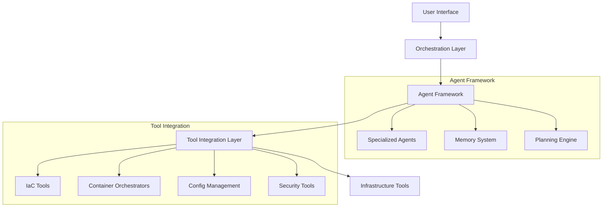
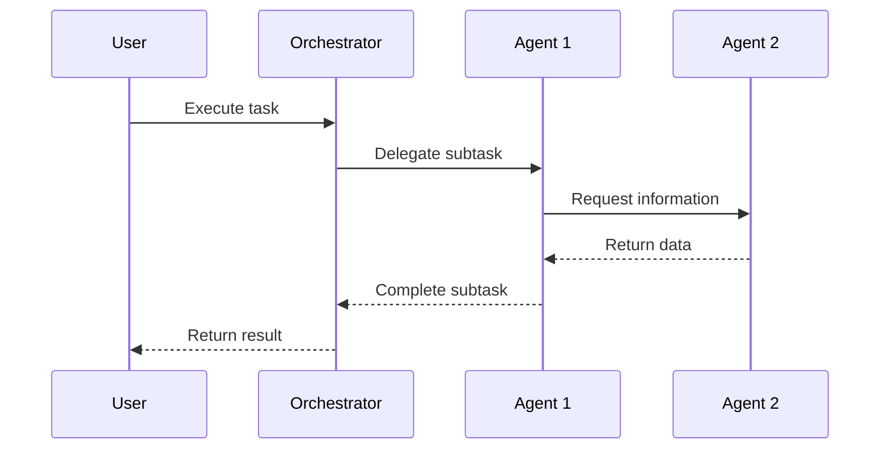

# 🚀 AI-AH: Agentic Infrastructure Team - Implementation Plan

## 📋 Table of Contents
1. [Project Overview](#-project-overview)
2. [Architecture](#-architecture)
3. [Tool Integration](#-tool-integration)
4. [Agent Framework](#-agent-framework)
5. [Implementation Phases](#-implementation-phases)
6. [Getting Started](#-getting-started)
7. [Development Guidelines](#-development-guidelines)
8. [Testing Strategy](#-testing-strategy)
9. [Deployment](#-deployment)
10. [Roadmap](#-roadmap)

## 🌟 Project Overview

AI-AH is an agentic AI system designed to autonomously manage infrastructure using a comprehensive suite of tools. It combines multiple infrastructure tools under a unified interface with intelligent decision-making capabilities.

**Core Objectives:**
- Unify diverse infrastructure tools
- Enable autonomous infrastructure management
- Provide human-like reasoning and decision making
- Ensure security and compliance by design

## 🏗️ Architecture

### High-Level Architecture



### Core Components

1. **Orchestration Layer**
   - API Gateway
   - Authentication & Authorization
   - Request Routing
   - Workflow Engine

2. **Agent Framework**
   - Base Agent Class
   - Specialized Agents
   - Memory System
   - Planning Engine

3. **Tool Integration**
   - Unified Adapter Pattern
   - Tool Registry
   - State Management
   - Error Handling

## 🛠️ Tool Integration

### Supported Tools Matrix

| Category           | Tools                                                                 | Status  |
|--------------------|----------------------------------------------------------------------|---------|
| Infrastructure as Code | Terraform, Pulumi, AWS CDK, CloudFormation                     | Planned |
| Container Orchestration | Kubernetes, Docker Swarm, Nomad, ECS                          | Planned |
| Configuration Mgmt  | Ansible, Chef, Puppet, SaltStack                                  | Planned |
| Secret Management   | HashiCorp Vault, AWS Secrets Manager, Azure Key Vault            | Planned |
| Monitoring         | Prometheus, Grafana, ELK Stack, Datadog                          | Planned |
| CI/CD              | Jenkins, GitLab CI, GitHub Actions, ArgoCD                       | Planned |
| Security           | OPA, Checkov, Trivy, Aqua Security                              | Planned |
| Cloud Providers    | AWS, Azure, GCP, DigitalOcean, Alibaba Cloud                    | Planned |

### Integration Pattern

```python
class ToolAdapter(ABC):
    @abstractmethod
    async def execute(self, command: Dict) -> Dict:
        pass
        
    @abstractmethod
    def validate(self, config: Dict) -> bool:
        pass
        
    @abstractmethod
    def get_metrics(self) -> Dict:
        pass
```

## 🤖 Agent Framework

### Agent Types

1. **Infrastructure Agent**
   - Manages provisioning and configuration
   - Handles Terraform, CloudFormation, etc.
   
2. **Security Agent**
   - Enforces security policies
   - Scans for vulnerabilities
   
3. **Cost Agent**
   - Optimizes resource usage
   - Forecasts costs
   
4. **Operations Agent**
   - Handles day-to-day operations
   - Monitors and maintains systems

### Agent Communication



## 🚦 Implementation Phases

### Phase 1: Foundation (Weeks 1-4)

**Goals:**
- [ ] Set up project structure
- [ ] Implement core agent framework
- [ ] Add basic tool adapters
- [ ] Create CI/CD pipeline

**Deliverables:**
- Core agent framework
- Basic tool adapters (Terraform, Kubernetes)
- Local development environment
- Initial test suite

### Phase 2: Core Functionality (Weeks 5-12)

**Goals:**
- [ ] Implement specialized agents
- [ ] Add more tool integrations
- [ ] Develop planning engine
- [ ] Create basic UI

**Deliverables:**
- Working multi-agent system
- Multiple tool integrations
- Basic planning capabilities
- Web interface

### Phase 3: Advanced Features (Weeks 13-20)

**Goals:**
- [ ] Add learning capabilities
- [ ] Implement security features
- [ ] Enhance monitoring
- [ ] Optimize performance

**Deliverables:**
- Self-improving system
- Production-ready security
- Comprehensive monitoring
- Performance optimizations

## 🚀 Getting Started

### Prerequisites

- Python 3.10+
- Docker
- Kubernetes (for container orchestration)
- Terraform

### Installation

```bash
# Clone the repository
git clone https://github.com/your-org/ai-ah.git
cd ai-ah

# Set up virtual environment
python -m venv venv
source venv/bin/activate  # On Windows: venv\Scripts\activate

# Install dependencies
pip install -r requirements.txt

# Set up pre-commit hooks
pre-commit install
```

### Configuration

1. Copy the example config:
   ```bash
   cp config.example.yaml config.yaml
   ```

2. Update the configuration with your settings:
   ```yaml
   logging:
     level: INFO
     format: "%(asctime)s - %(name)s - %(levelname)s - %(message)s"
   
   agents:
     infrastructure:
       enabled: true
       tools:
         - terraform
         - kubernetes
     security:
       enabled: true
   
   tools:
     terraform:
       path: /usr/local/bin/terraform
       backend: s3
   ```

### Running Locally

```bash
# Start the agent system
python -m ai_ah.main

# Or run with Docker
docker-compose up
```

## 📝 Development Guidelines

### Code Style

- Follow PEP 8
- Use type hints
- Write docstrings
- Keep functions small and focused

### Git Workflow

1. Create a feature branch:
   ```bash
   git checkout -b feature/your-feature-name
   ```

2. Make your changes and commit:
   ```bash
   git add .
   git commit -m "Add your feature"
   ```

3. Push and create a pull request

### Testing

Run the test suite:

```bash
# Run all tests
pytest

# Run tests with coverage
pytest --cov=ai_ah tests/

# Run a specific test
pytest tests/test_agent.py::TestAgent::test_agent_initialization
```

## 🧪 Testing Strategy

### Unit Tests
- Test individual components in isolation
- Mock external dependencies
- Focus on business logic

### Integration Tests
- Test component interactions
- Use test containers for dependencies
- Verify end-to-end workflows

### Performance Tests
- Benchmark critical paths
- Identify bottlenecks
- Ensure scalability

## 🚀 Deployment

### Kubernetes

```yaml
apiVersion: apps/v1
kind: Deployment
metadata:
  name: ai-ah
spec:
  replicas: 3
  selector:
    matchLabels:
      app: ai-ah
  template:
    metadata:
      labels:
        app: ai-ah
    spec:
      containers:
      - name: ai-ah
        image: ghcr.io/your-org/ai-ah:latest
        ports:
        - containerPort: 8000
        envFrom:
        - secretRef:
            name: ai-ah-secrets
```

### Docker Compose

```yaml
version: '3.8'

services:
  ai-ah:
    image: ghcr.io/your-org/ai-ah:latest
    ports:
      - "8000:8000"
    environment:
      - LOG_LEVEL=INFO
    volumes:
      - ./config:/app/config
    depends_on:
      - redis
      - postgres

  redis:
    image: redis:alpine
    ports:
      - "6379:6379"

  postgres:
    image: postgres:13-alpine
    environment:
      - POSTGRES_USER=ai_ah
      - POSTGRES_PASSWORD=ai_ah_password
      - POSTGRES_DB=ai_ah
    volumes:
      - postgres_data:/var/lib/postgresql/data

volumes:
  postgres_data:
```

## 🗺️ Roadmap

### Q4 2023
- [ ] Core agent framework
- [ ] Basic tool integrations
- [ ] Initial release

### Q1 2024
- [ ] Advanced planning
- [ ] More tool integrations
- [ ] Production deployment

### Q2 2024
- [ ] Learning capabilities
- [ ] Enhanced security
- [ ] Enterprise features

## 🤝 Contributing

1. Fork the repository
2. Create your feature branch
3. Commit your changes
4. Push to the branch
5. Create a new Pull Request

## 📄 License

This project is licensed under the MIT License - see the [LICENSE](LICENSE) file for details.

## 🙏 Acknowledgments

- [LangChain](https://github.com/hwchase17/langchain)
- [AutoGPT](https://github.com/Significant-Gravitas/Auto-GPT)
- [Terraform](https://www.terraform.io/)
- [Kubernetes](https://kubernetes.io/)
