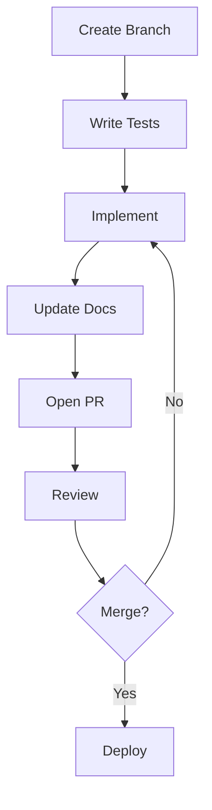

# 🏛️ AI-AH Project Governance

## 1. Core Documentation Structure

### 1.1 Project Context
- `CONTEXT.md` - Project vision, principles, and constraints
- `ARCHITECTURE.md` - System architecture and design decisions
- `ROADMAP.md` - Development roadmap and milestones

### 1.2 Decision Records
- `docs/decisions/` - ADRs (Architecture Decision Records)
  - Template: `YYYYMMDD-short-description.md`
  - Required for all significant technical decisions

### 1.3 Knowledge Base
- `docs/knowledge/`
  - `patterns/` - Established solution patterns
  - `antipatterns/` - Known bad approaches
  - `integrations/` - Tool integration guides

## 2. Automated Verification

### 2.1 Pre-commit Hooks
```yaml
# .pre-commit-config.yaml
repos:
-   repo: local
    hooks:
    -   id: context-validation
        name: Validate project context
        entry: scripts/validate_context.py
        language: python
        types: [python]
        stages: [commit]

-   repo: https://github.com/pre-commit/pre-commit-hooks
    rev: v4.3.0
    hooks:
    -   id: check-added-large-files
    -   id: check-yaml
    -   id: end-of-file-fixer
    -   id: trailing-whitespace
```

### 2.2 CI/CD Pipeline
```yaml
# .github/workflows/validate.yml
name: Project Validation

on:
  push:
    branches: [ main ]
  pull_request:
    branches: [ main ]

jobs:
  validate:
    runs-on: ubuntu-latest
    steps:
    - uses: actions/checkout@v3
    - name: Validate Documentation
      run: |
        ./scripts/check_docs.sh
        ./scripts/validate_architecture.py
```

## 3. Governance Processes

### 3.1 Decision Making
1. **Proposal**: Create ADR in `docs/decisions/`
2. **Review**: 48-hour review period
3. **Approval**: At least 2 maintainers must approve
4. **Implementation**: After approval, update relevant docs

### 3.2 Code Review Checklist
- [ ] Follows project patterns
- [ ] Includes tests
- [ ] Updates documentation
- [ ] Passes all validations
- [ ] No hardcoded values

### 3.3 Weekly Sync
- Review open ADRs
- Check project health metrics
- Address technical debt

## 4. Contributor Onboarding

### 4.1 First Steps
1. Read `CONTEXT.md` and `ARCHITECTURE.md`
2. Complete onboarding exercises in `docs/onboarding/`
3. Shadow code reviews

### 4.2 Development Workflow


## 5. Compliance Monitoring

### 5.1 Automated Checks
- Documentation coverage
- Test coverage
- Pattern adherence
- Security scanning

### 5.2 Manual Audits
- Monthly architecture review
- Documentation health check
- Process effectiveness review

## 6. Enforcement

### 6.1 Branch Protection
- Require passing CI
- Require code reviews
- Enforce signed commits
- Require updated documentation

### 6.2 Documentation Linting
```bash
# scripts/check_docs.sh
#!/bin/bash
set -e

# Check for missing documentation
if ! grep -q "## Changes" CHANGELOG.md; then
    echo "❌ CHANGELOG.md not updated"
    exit 1
fi

# Verify ADRs
find docs/decisions -name "*.md" | while read -r file; do
    if ! grep -q "Status: " "$file"; then
        echo "❌ Missing status in $file"
        exit 1
    fi
done
```

## 7. Metrics and Reporting

### 7.1 Dashboard
- Documentation coverage
- Test coverage
- Decision velocity
- Review turnaround time

### 7.2 Health Score
Calculated weekly based on:
- Documentation completeness
- Test coverage
- Open ADRs
- Code quality metrics

## 8. Continuous Improvement

### 8.1 Retrospectives
- Monthly review of governance effectiveness
- Process improvement backlog
- Tooling updates

### 8.2 Feedback Loops
- Anonymous feedback form
- Architecture review meetings
- Contributor surveys
